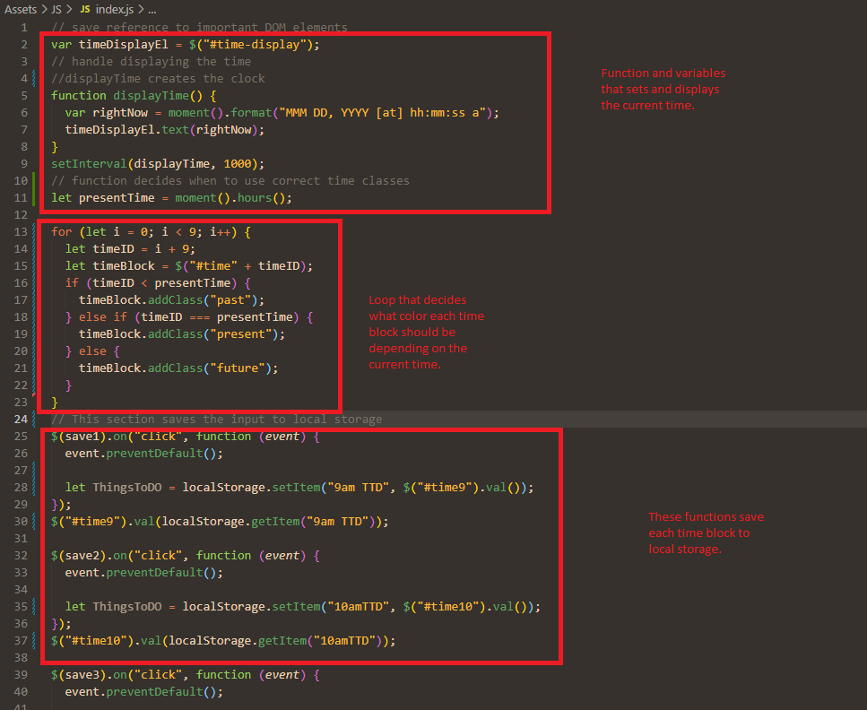

# Word Day Scheduler

https://kernbryson.github.io/HW5WorkDayScheduler/ 

## Description

For this project I created a work day scheduler. This scheduler allows users to keep up with what they need to do throughout the work day. My motivation behind this project was to create a working scheduler to improve my javascript skills. This scheduler makes it easier for users to get things done during their day because everything they need to do is all in one central location. While creating this project I learned a lot about local storage and creating elements in javascript.

## Table of Contents

- [Creation](#Creation)
- [Usage](#usage)
- [Credits](#credits)
- [License](#license)

## Creation

In order to create this scheduler, I first created my HTML. I used a lot of components from bootstrap to make my project look professional while also saving time. I then began creating ID's and styling my HTML with my style page. The first main task I wanted to complete was to create a clock through Moment JS. In order to properly display the time I used the "moment().format" statement. After I got that out of the way I began working on the save buttons. I first turned all of the right hand columns I got from bootstrap into buttons so I could then later give them a function in my javascript. I also used Font Awesome to obtain custom save icons for the buttons. After I created my save buttons I began to work on my javascript. The first hurdle I had to jump over was creating a function that would dynamically change the color of each time block depending on the time. In order to do this, I created a function with a for loop that added the class of past, present, or future depending on the current time. The last difficult task was saving all the user's data to local storage. In order to save all the tasks that have been submitted I made multiple functions that get the users text input once they clicked the save button. At the end of each of those functions I called the data back with the "get item" command.

## Usage

The scheduler is very easy to use. All the user needs to do is type in the task or reminder they want that corresponds with the correct time block and click the save button. The user can then leave the page and come back whenever they need a refresher and their previous data will still be displayed. The coloration with each time block helps users keep up with the current time and what tasks they should be working on.

## Credits

- Professional README - https://coding-boot-camp.github.io/full-stack/github/professional-readme-guide
- Web Dev Simplified - https://www.youtube.com/c/WebDevSimplified
- Bootstrap - https://getbootstrap.com/
- Moment js - https://momentjs.com/

## License

Copyright (c) [2022] [Bryson Kern]

Permission is hereby granted, free of charge, to any person obtaining a copy
of this software and associated documentation files (the "Software"), to deal
in the Software without restriction, including without limitation the rights
to use, copy, modify, merge, publish, distribute, sublicense, and/or sell
copies of the Software, and to permit persons to whom the Software is
furnished to do so, subject to the following conditions:

The above copyright notice and this permission notice shall be included in all
copies or substantial portions of the Software.

THE SOFTWARE IS PROVIDED "AS IS", WITHOUT WARRANTY OF ANY KIND, EXPRESS OR
IMPLIED, INCLUDING BUT NOT LIMITED TO THE WARRANTIES OF MERCHANTABILITY,
FITNESS FOR A PARTICULAR PURPOSE AND NONINFRINGEMENT. IN NO EVENT SHALL THE
AUTHORS OR COPYRIGHT HOLDERS BE LIABLE FOR ANY CLAIM, DAMAGES OR OTHER
LIABILITY, WHETHER IN AN ACTION OF CONTRACT, TORT OR OTHERWISE, ARISING FROM,
OUT OF OR IN CONNECTION WITH THE SOFTWARE OR THE USE OR OTHER DEALINGS IN THE
SOFTWARE.
